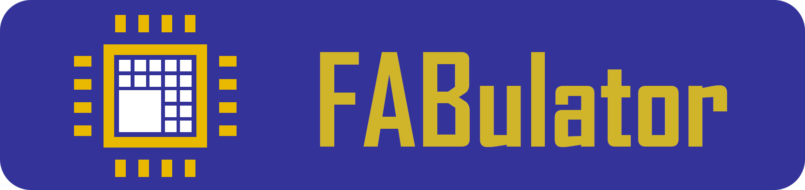
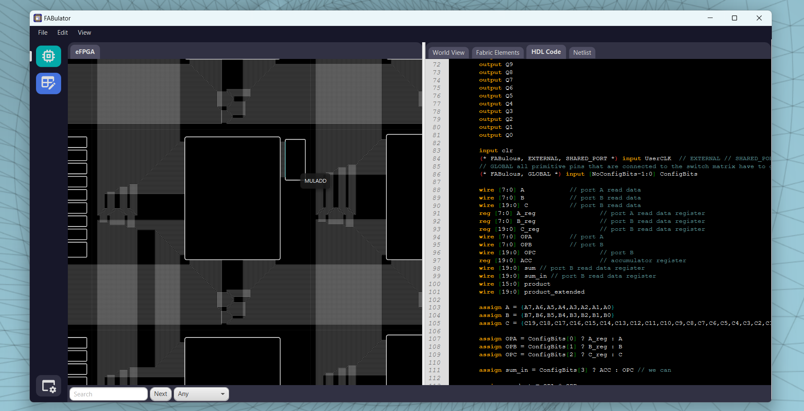
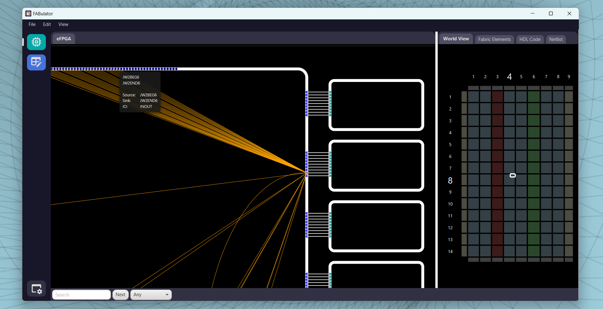
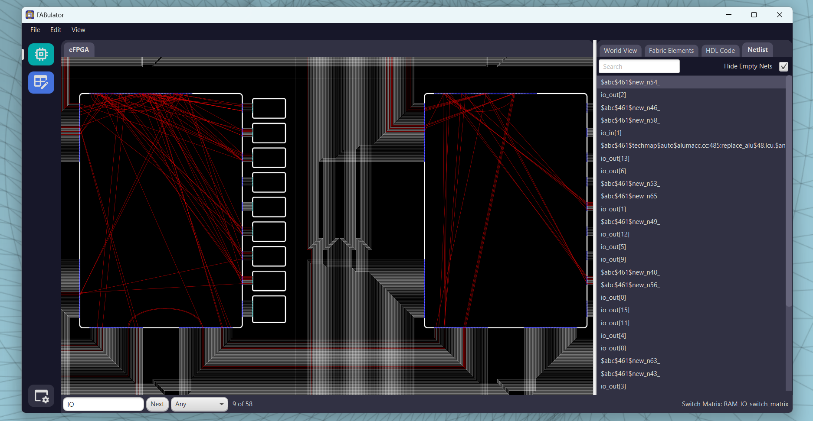
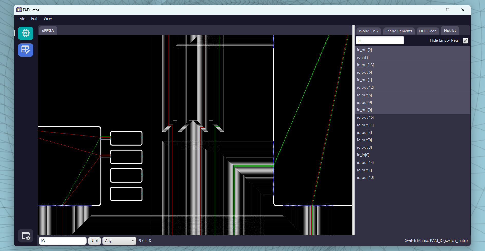
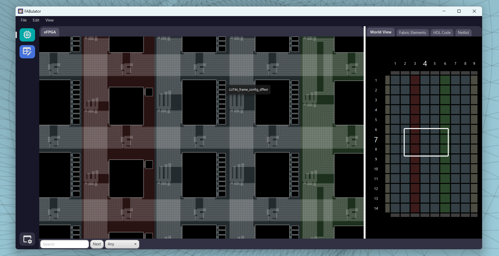

<h1 align="center">
    
</h1>

<p align="center">
    <a href="https://github.com/FPGA-Research-Manchester/FABulator/issues" title="Open Issues">
        
    </a>
    <a href="https://github.com/FPGA-Research-Manchester/FABulator/actions/workflows/build_and_test.yml" title="Build and Test">
        
    </a>
    <a href="./LICENSE" title="License">
        
    </a>
</p>

FABulator is the graphical frontend of [FABulous](https://github.com/FPGA-Research-Manchester/FABulous). 
It can be used to explore fabrics generated by FABulous and provides several features:

- Exploration and Searching
- Easy Navigation and a High Detail View of the Fabric
- Displaying user designs (experimental)
- Viewing HDL code of Bels, Switch Matrices

Additional features are planned, including:
- Interactive architecture editing
- User design editing

For infos on planned features, refer to [Planned Features](docs/user/plannedFeatures.md)

## Disclaimer

FABulator is in its alpha stage and several 
features are still experimental. Known bugs 
can be found in 
[Known Bugs](docs/developer/knownBugs.md).

## Getting Started

### Prerequisites
FABulator uses Java 17. On linux, the jdk can
be installed with

```
sudo apt install openjdk-17-jdk
```

To build and run FABulator, maven is required. 
On a linux machine, it can be installed with
```
sudo apt install maven
```

### Setup

To set up FABulator:

```
git clone https://github.com/FPGA-Research-Manchester/FABulator
cd FABulator
```


### Build and Run
To build and run:

```
mvn javafx:run
```

**Or alternatively:**

Build an executable jar:
```
mvn clean package
```
And run with
```
java -jar <output_jar>
```

### Usage

For information on how to use FABulator, see [How To Use](docs/user/howToUse.md)

## Screenshots

### View of a DSP tile with the HDL code of its bel


### Clicking on a port displays its programmable connections


### Displaying a user design


### Selecting nets


### Tiles can be color coded


## Documentation

Documentation both for the user and developer side can be found at [Documentation](/docs)
